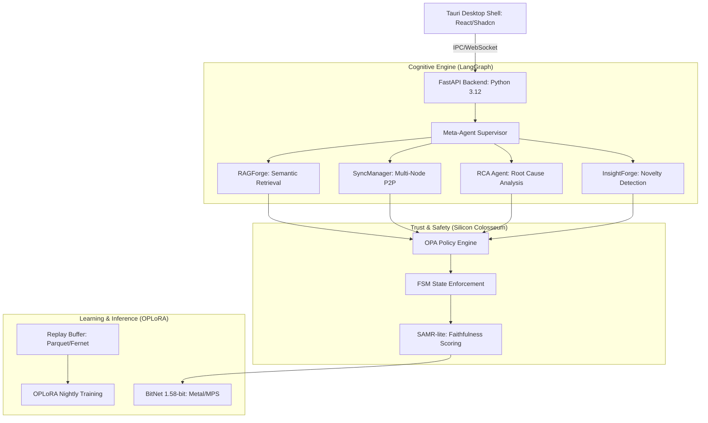

# AetherForge v1.0
## The Sovereign AI Operating System: Local, Perpetual, Glass-Box.

[](https://opensource.org/licenses/MIT)
[](https://www.python.org/downloads/)
[](https://www.typescriptlang.org/)
[](https://tauri.app/)

---

## 🏛 Architectural Thesis

AetherForge is not just another LLM wrapper; it is a **Sovereign Intelligence Layer** designed to solve the four horsemen of production AI: **Privacy Leakage**, **Catastrophic Forgetting**, **Hallucination**, and **Black-Box Reasoning**. 

By unifying high-performance 1.58-bit ternary inference with a closed-loop perpetual learning architecture, AetherForge provides a "Glass-Box" environment where every decision is traceable, every policy is enforceable, and every interaction contributes to a locally-governed cognitive evolution.

### Key Value Propositions
*   **100% Local Privacy**: Zero-telemetry design. Your data never leaves your silicon.
*   **Perpetual Evolution**: Integrated Replay Buffer and OPLoRA nightly fine-tuning loop ensures the system grows smarter with every session without forgetting core competencies.
*   **Deterministic Governance**: Every tool call is gated by the "Silicon Colosseum"—a hybrid OPA (Open Policy Agent) and FSM (Finite State Machine) guardrail system.
*   **Causal Observability**: Real-time X-Ray mode visualizes LangGraph decision chains and causal graphs, turning "Black-Box" AI into an auditable operation.

---

## 🏗 System Architecture



---

## 🚀 Key Unique Capabilities

### 1. OPLoRA (Orthogonal Projection LoRA)
AetherForge utilizes a proprietary SVD-based projection mechanism to prevent catastrophic forgetting. By decomposing LoRA weight deltas and projecting new updates onto the orthogonal complement of the preserved knowledge subspace, we achieve continuous learning without the need for expensive replay-data distillation.

### 2. Silicon Colosseum & SAMR-lite
We replace "vibe-based" safety with deterministic policy enforcement.
- **OPA Integration**: Real-time Rego policy evaluation for every tool invocation.
- **FSM Guardrails**: Enforces valid agentic state transitions.
- **SAMR-lite**: A lightweight, locally-calculated Semantic Alignment & Model Reliability scorer that blocks hallucinations before they reach the user.

### 3. BitNet 1.58-bit Core
Native support for ternary quantized models ({-1, 0, +1}). This architecture replaces complex floating-point multiplications with simple integer additions, enabling 80+ tokens/sec on base M1 silicon while reducing the memory footprint by 70%.

---

## 📂 Project Organization

```text
AtherForge/
├── src/                # Core Backend Architecture
│   ├── main.py         # Entrypoint & CLI Supervisor
│   ├── app_factory.py  # Lifespan management & Dependency Injection
│   ├── meta_agent.py   # LangGraph Supervisor Logic
│   ├── guardrails/     # Silicon Colosseum (OPA/FSM)
│   ├── learning/       # OPLoRA, Replay Buffer, & Evolution Engine
│   └── modules/        # Domain-specific Agentic Graphs
├── Test_related/       # Consolidated Validation Suite
│   ├── tests/          # Pytest units & integration suites
│   └── scripts/        # Benchmarking & evaluation utilities
├── frontend/           # High-Fidelity React HUD
├── data/               # Local Persistent Store (Encrypted)
│   ├── logs/           # Centralized Traceability Logs
│   └── chroma/         # Vector Embeddings Cache
├── models/             # GGUF/BitNet Weights
└── runtime/            # Multi-platform build & run scripts
```

---

## 🛠 Prerequisites & Deployment

- **Silicon**: Apple M1/M2/M3 (Recommended) or x86_64 with AVX2.
- **Stack**: Python 3.12, Node.js 20+, Rust 1.78+.
- **Memory**: 8GB Floor (16GB recommended for OPLoRA training).

```bash
# Initial Provisioning
./install.sh

# Orchestrate Dev Stack
./run_dev.sh

# Launch Desktop HUD
npm run tauri:dev
```

---

## ⚖️ Governance & Security

*   **Encryption**: Session data via SQLCipher (AES-256); Replay Buffers via Age/Fernet.
*   **Network Isolation**: Local-only by default (`127.0.0.1`). DuckDuckGo search and Location services are opt-in.
*   **Auditability**: Every agent decision generates a JSON-LD compliant causal trace.

---

MIT License | Built for the Era of Sovereign Intelligence.
*Runs on your Mac. Learns from your context. Forgets nothing important.*
