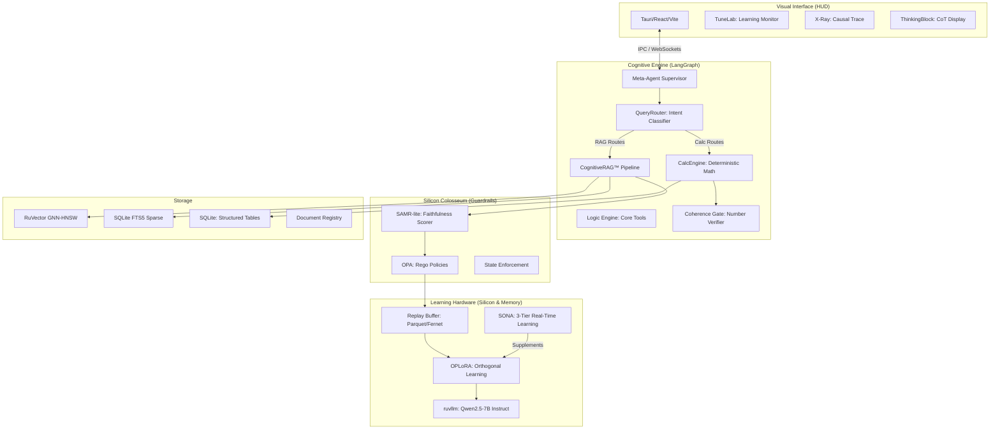

# AetherForge v1.2 — The Sovereign Intelligence OS
## Local, Perpetual, Glass-Box AI for the Edge.

[](https://opensource.org/licenses/MIT)
[](https://www.python.org/downloads/)
[](https://www.typescriptlang.org/)
[](https://tauri.app/)

---

> [!NOTE]
> **Status: Public Beta.** AetherForge runs entirely on-device (Apple Silicon optimised, expanding to Linux/Windows). Zero cloud dependencies. Zero data exfiltration.

---

## 🏛️ What Is AetherForge?

AetherForge is a **Sovereign Intelligence Layer** — a desktop-native AI system that **learns**, **reasons**, and **calculates** entirely on your hardware with no internet required. It is designed for professionals in high-stakes domains (defence, maritime, legal, medical) where cloud dependency and data leakage are non-negotiable risks.

Unlike standard RAG frameworks that simply retrieve and pass text to an LLM, AetherForge implements:
- **Closed-Loop Perpetual Learning** — it learns from every interaction without forgetting previous knowledge
- **Deterministic Calculation** — numeric queries bypass the LLM entirely and use verified table interpolation
- **Glass-Box Reasoning** — every decision is auditable with full reasoning traces exposed in real-time
- **Air-Gapped Security** — encrypted storage, no telemetry, no external API calls

### The "Glass-Box" Philosophy
AetherForge solves the "Black Box" problem by exposing internal reasoning traces in real-time. Every decision — from query decomposition to faithfulness scoring — is auditable, traceable, and governed by deterministic policies. The system enforces a hard rule: **LLMs explain; they never calculate.**

---

## 🛠️ Technology Stack

| Layer | Technology | Purpose |
|:------|:-----------|:--------|
| **Desktop Shell** | Tauri 2.1 (Rust) | Native desktop app with IPC bridge to the backend |
| **Frontend** | React 18 + TypeScript 5.5 + Vite | HUD interface with X-Ray tracing, ThinkingBlock, TuneLab |
| **Backend** | Python 3.12 + FastAPI + Uvicorn | REST API, WebSocket streaming, async document processing |
| **Orchestration** | LangGraph + LangChain Core | Meta-Agent supervisor pattern with module sub-graphs |
| **LLM Inference** | ruvllm (Rust GGUF) + llama-cpp-python | Native Qwen2.5-7B-Instruct-Q4_K_M via Tauri commands; Python fallback |
| **Vector Store** | RuVector GNN-HNSW (NPM CLI) | Graph Neural Network + Hierarchical Navigable Small World index |
| **Sparse Search** | SQLite FTS5 | BM25 keyword search for hybrid retrieval |
| **Structured Data** | SQLite | Hydrostatic tables, deterministic CalcEngine lookups |
| **Document Processing** | IBM Docling + PyMuPDF + OCR | Smart loading: tables, equations, reading order preservation |
| **VLM Enrichment** | SmolVLM / Florence-2 | Visual understanding for scanned PDFs and image-heavy documents |
| **Embeddings** | all-MiniLM-L6-v2 (HuggingFace) | 384-dim sentence embeddings, normalised cosine similarity |
| **Learning** | OPLoRA (SVD orthogonal projection) + SONA 3-tier | Continual learning without catastrophic forgetting |
| **Guardrails** | Silicon Colosseum (OPA/Rego + FSM) | Deterministic policy enforcement, not probabilistic safety filters |
| **Encryption** | SQLCipher | AES-256 encrypted session storage |

---

## 🏗️ System Architecture



---

## 🧠 Core Innovations

### 1. RuVector GNN-HNSW — Vector Store Architecture

AetherForge uses **RuVector** as its primary vector store, replacing ChromaDB. RuVector is an NPM-based CLI tool that implements a **Graph Neural Network + Hierarchical Navigable Small World** (GNN-HNSW) index, providing unified dense + sparse hybrid search.

**How it works:**
- Documents are embedded using `all-MiniLM-L6-v2` (384 dimensions, cosine similarity)
- Vectors are stored in `.rvf` binary files via the `npx ruvector rvf ingest` CLI
- Queries are executed via `npx ruvector rvf query` with k-NN search
- The Python `RuVectorStore` class (`src/modules/ragforge/ruvector_store.py`) implements the LangChain `VectorStore` interface, bridging Python to the native RuVector CLI
- Deduplication uses `rvf delete` before re-indexing to prevent chunk accumulation

**Data flow for ingestion:**
```
File dropped in LiveFolder → DirectoryWatcher → DocumentIntelligenceService
  → IBM Docling (tables/equations/sections) → Semantic Chunker
  → all-MiniLM-L6-v2 embedding → RuVectorStore.add_texts() → .rvf file
  → SparseIndex.add_documents() → FTS5 SQLite
  → TableExtractor → structured_data.db (for CalcEngine)
```

### 2. CognitiveRAG™ — 7-Stage Reasoning Pipeline

AetherForge replaces "one-shot RAG" with a deep thinking pipeline that reuses the LLM across multiple reasoning stages:

| Stage | Name | What It Does |
|:------|:-----|:-------------|
| ① | **Query Understanding** | Classifies intent: Factual, Synthesis, Comparative, Calculation |
| ② | **Decomposition** | Breaks complex queries into a DAG of sub-questions |
| ③ | **HyDE** | Generates hypothetical "golden" documents to guide vector search |
| ④ | **Hybrid Search** | Fuses RuVector GNN-HNSW (dense) + FTS5 BM25 (sparse) via Reciprocal Rank Fusion |
| ⑤ | **Evidence Scoring** | Ranks chunks based on multidimensional relevance |
| ⑥ | **Chain-of-Thought** | Synthesises the final answer within a verifiable `<think>` reasoning block |
| ⑦ | **Self-Verification** | Measures faithfulness via SAMR-lite (cosine similarity ≥ 0.55 threshold) |

### 3. Query Router + CalcEngine — Deterministic Calculation

For all numeric queries (displacement, TPC, MTC, draft corrections), the **QueryRouter** (`src/core/query_router.py`) classifies intent *before* any LLM call. Identified calculation routes:
- `TABLE_LOOKUP` — single column interpolation
- `MULTI_LOOKUP` — all hydrostatic columns at a draft
- `INTERPOLATE` — linear interpolation between tabulated drafts
- `UNIT_CONVERT` — salt water → fresh water or dock water corrections

These bypass the LLM entirely → **CalcEngine** (`src/core/calc_engine.py`) performs deterministic table interpolation from SQLite → The LLM only writes a natural-language wrapper around the verified numbers → The **Coherence Gate** (`src/guardrails/coherence_gate.py`) then verifies every number in the explanation traces back to the CalcEngine output.

### 4. OPLoRA — Perpetual Learning Without Forgetting

Standard fine-tuning (LoRA) on new data destroys previously learned knowledge (Catastrophic Forgetting). AetherForge implements **Orthogonal Projection LoRA (OPLoRA)**:

Before training on a new task $T_k$, we compute the knowledge subspace of the existing weights using **SVD** and build a projector $P$ onto the **orthogonal complement**:
$$P = I - U_k U_k^T$$
All gradient updates $\Delta W$ are projected: $\Delta W_{safe} = P_{left} \Delta W P_{right}$

This ensures new learning happens only in the "null space" of previous memories, preserving 100% of past intelligence. OPLoRA runs as a **nightly batch job** (3 AM) consuming the day's replay buffer.

### 5. SONA — 3-Tier Real-Time Learning

Supplements OPLoRA nightly batch with per-request adaptation:
- **Tier 1: MicroLoRA** — Rank-2 adaptation in <1ms per accepted response
- **Tier 2: EWC++** — Elastic Weight Consolidation prevents catastrophic forgetting between tiers
- **Tier 3: ReasoningBank** — Stores successful query→answer trajectories as curriculum for future training

SONA requires the optional `ruvector-sona` package. When unavailable, OPLoRA nightly batch handles all learning.

### 6. ruvllm — Native Rust LLM Inference

Replaces the Ollama HTTP round-trip with direct GGUF inference via Tauri commands:
- **Model**: Qwen2.5-7B-Instruct-Q4_K_M (stored at `/Volumes/Apple/AI Model/`)
- **Context Window**: 16,384 tokens (2× the old 8,192 limit)
- **Interface**: `ruvllm_bridge.rs` Tauri command callable from frontend
- **Fallback**: Python-side `llama-cpp-python` inference if model file is unavailable

### 7. Silicon Colosseum — Deterministic Alignment

Replaces probabilistic safety filters with a **Deterministic Policy Engine**:
- **OPA (Open Policy Agent)**: Evaluates usage budgets and content safety using **Rego** policies
- **Finite State Machine (FSM)**: Enforces lifecycle invariants (e.g., ensuring a reasoning trace exists before a response is allowed)
- **SAMR-lite**: Local semantic faithfulness scorer that computes cosine similarity between response and grounded evidence. Responses below **0.55** threshold are automatically **blocked** (not just warned)

### 8. Boot-Sweep & Document Registry

On every startup, AetherForge runs a **Boot-Sweep** that cross-references the `document_registry.db` against actual files in `data/LiveFolder/` and `data/uploads/`. Any database records for files that no longer exist on disk are purged, preventing "ghost" documents from appearing in the UI.

---

## 📦 Features

### Document Processing
- **Smart PDF Loading**: IBM Docling for digital PDFs (tables, equations, reading order), PyMuPDF + VLM for scanned PDFs
- **LiveFolder Monitoring**: Drop files into `data/LiveFolder/` and they're automatically indexed
- **Upload API**: POST files via REST API with progress tracking
- **Semantic Chunking**: Splits at section/table/equation boundaries — never mid-formula
- **VLM Enrichment**: Automatic visual extraction for image-heavy pages (SmolVLM, Florence-2)
- **Structured Table Extraction**: Tables extracted at ingestion time into SQLite for deterministic CalcEngine use

### Retrieval & Search
- **Hybrid Search**: RuVector GNN-HNSW (dense) + FTS5 BM25 (sparse) with Reciprocal Rank Fusion
- **Document Filtering**: Select/deselect documents in the UI to scope searches
- **HTI Tree View**: Hierarchical section browser for navigating document structure
- **Citation Generation**: Every response includes traceable source references

### User Interface (Tauri Desktop)
- **ThinkingBlock**: Collapsible `<think>` tag display showing the LLM's chain-of-thought reasoning
- **X-Ray Mode**: Real-time causal graph of every node visited during reasoning
- **TuneLab**: Learning monitor showing OPLoRA/SONA statistics
- **Session Management**: Persistent encrypted chat histories with export to PDF/Markdown
- **Module Panels**: Separate views for RAGForge, Analytics, StreamSync, WatchTower

### Learning & Adaptation
- **OPLoRA Nightly**: SVD-based orthogonal learning at 3 AM from the day's replay buffer
- **SONA Real-Time**: Optional per-request MicroLoRA + EWC++ + ReasoningBank
- **Replay Buffer**: Encrypted Parquet/Fernet interaction storage for training data
- **History Manager**: Conversation history for context and learning

### Security & Governance
- **Air-Gapped**: 100% offline operation, no internet required
- **SQLCipher Encryption**: AES-256 encrypted session storage
- **OPA/Rego Policies**: Deterministic guardrails, not probabilistic filters
- **Coherence Gate**: Number verification for every calculation response
- **Peer-to-Peer Sync**: Encrypted device synchronisation via SyncManager

---

## 📂 Repository Structure

```text
AtherForge/
├── src/                           # Python backend (FastAPI)
│   ├── core/                      # DI Container, CalcEngine, QueryRouter, Grammar
│   │   ├── container.py           # Service lifecycle & dependency injection
│   │   ├── calc_engine.py         # Deterministic table interpolation (no LLM math)
│   │   └── query_router.py        # Intent classifier (fires before any LLM call)
│   ├── guardrails/                # Silicon Colosseum
│   │   ├── silicon_colosseum.py   # OPA/Rego policy enforcement
│   │   └── coherence_gate.py     # Number trace verifier for calc responses
│   ├── learning/                  # Continual Learning
│   │   ├── oplora_trainer.py      # Orthogonal Projection LoRA (nightly batch)
│   │   ├── sona_adapter.py        # SONA 3-tier real-time learning
│   │   ├── replay_buffer.py       # Encrypted interaction storage (Parquet/Fernet)
│   │   └── history_manager.py     # Conversation history management
│   ├── modules/                   # Plugin Modules
│   │   ├── ragforge/              # CognitiveRAG™ pipeline
│   │   │   ├── ruvector_store.py  # RuVector CLI bridge (LangChain VectorStore)
│   │   │   ├── cognitive_rag.py   # 7-stage reasoning pipeline
│   │   │   ├── sparse_index.py    # SQLite FTS5 BM25 search
│   │   │   ├── vlm_enrich.py      # VLM visual extraction for scanned PDFs
│   │   │   └── table_extractor.py # Tables → SQLite for CalcEngine
│   │   ├── ragforge_indexer.py    # Precision Ingestion™ pipeline
│   │   ├── document_registry.py   # SQLite document metadata + boot-sweep purge
│   │   ├── session_store.py       # SQLCipher encrypted sessions
│   │   ├── analytics/             # Usage stats & data analysis
│   │   ├── streamsync/            # LiveFolder watcher + RSS integration
│   │   ├── sync/                  # Peer-to-peer encrypted sync
│   │   └── tunelab/               # Learning monitoring & visualisation
│   ├── routers/                   # FastAPI route handlers
│   ├── services/                  # Business logic (chat_turns, document_intelligence)
│   ├── meta_agent.py              # LangGraph Supervisor (the brain)
│   └── main.py                    # Application entry point
├── frontend/                      # React/Vite/TypeScript HUD
│   └── src/components/            # ThinkingBlock, X-Ray, TuneLab, DocumentPanel
├── src-tauri/src/                 # Rust Tauri shell
│   ├── ruvllm_bridge.rs           # Native GGUF inference via Tauri commands
│   └── lib.rs                     # Tauri plugin registration
├── data/                          # Persistent Storage (encrypted)
│   ├── LiveFolder/                # Drop files here for auto-ingestion
│   ├── uploads/                   # REST API uploaded files
│   ├── document_registry.db       # Document metadata (SQLite)
│   ├── sparse_index.db            # FTS5 BM25 index (SQLite)
│   ├── structured_data.db         # Hydrostatic tables for CalcEngine
│   ├── ruvector/                  # RuVector .rvf files
│   └── sessions.db                # Encrypted chat sessions (SQLCipher)
└── models/                        # LLM weights (Qwen2.5-7B GGUF)
```

---

## 🚀 Quick Start

### Prerequisites
- Apple Silicon Mac (M1+) or AVX2 CPU
- Python 3.12+
- Node.js 20+
- Rust toolchain (for Tauri)

### Installation
```bash
chmod +x install.sh && ./install.sh
```

### Running
```bash
# Full development stack (backend + frontend + Tauri)
./run_dev.sh

# Backend only
.venv/bin/python -m uvicorn src.main:app --host 127.0.0.1 --port 8765 --reload

# Frontend only (web)
npm run dev

# Desktop app
npm run tauri:dev
```

---

## 🔒 Environment Configuration

Key environment variables (`.env`):

| Variable | Default | Purpose |
|:---------|:--------|:--------|
| `QWEN_MODEL_PATH` | `/Volumes/Apple/AI Model/qwen2.5-7b-instruct-q4_k_m.gguf` | Path to GGUF model weights |
| `DATA_DIR` | `data` | Persistent storage root |
| `SQLCIPHER_KEY_FILE` | `data/.sqlcipher_key` | Encryption key for sessions |
| `SILICON_COLOSSEUM_MIN_FAITHFULNESS` | `0.55` | Minimum faithfulness score |
| `SILICON_COLOSSEUM_FAITHFULNESS_ACTION` | `block` | Action on low faithfulness |
| `HF_HOME` | `/Volumes/Apple/AI Model/hf_cache` | HuggingFace model cache |

---

## 🛡️ Industrial Use Cases

| Industry | Use Case | Innovation Applied |
|:---------|:---------|:-------------------|
| **Maritime/Defence** | Hydrostatic calculations, loading stability analysis | CalcEngine deterministic math, air-gapped security |
| **Legal** | Case-law synthesis and document discovery | CognitiveRAG 7-stage pipeline, verifiable CoT |
| **Medical** | Clinical trial synthesis on patient records | SQLCipher encryption, selective forgetting |
| **Finance** | Market analysis without leaking proprietary data | OPLoRA perpetual learning, replay buffer |
| **IoT/Edge** | Autonomous systems policy adjustment | OPA guardrails, FSM lifecycle enforcement |

---

MIT License | Built for the Era of Sovereign Intelligence.
*Runs on your Mac. Learns from your context. Forgets nothing important.*
