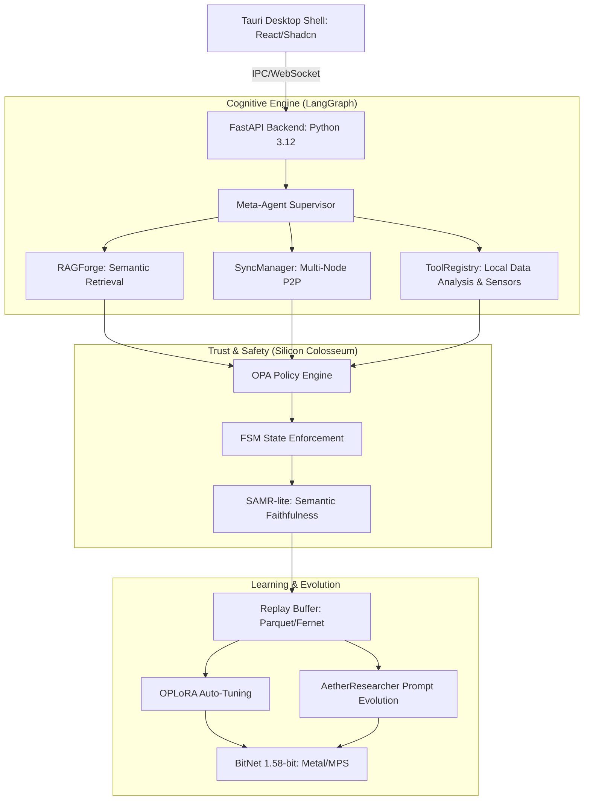

# AetherForge v1.1
## The Sovereign AI Operating System: Local, Perpetual, Glass-Box.

[](https://opensource.org/licenses/MIT)
[](https://www.python.org/downloads/)
[](https://www.typescriptlang.org/)
[](https://tauri.app/)

---

## 🏛 Architectural Thesis

AetherForge is not just another LLM wrapper; it is a **Sovereign Intelligence Layer** designed to solve the four horsemen of production AI: **Privacy Leakage**, **Catastrophic Forgetting**, **Hallucination**, and **Black-Box Reasoning**. 

By unifying high-performance 1.58-bit ternary inference with a closed-loop perpetual learning architecture, AetherForge provides a "Glass-Box" environment where every decision is traceable, every policy is enforceable, and every interaction contributes to a locally-governed cognitive evolution.

### Key Value Propositions
*   **100% Local Privacy**: Zero-telemetry design. Your data never leaves your silicon.
*   **Perpetual Evolution & Prompt Optimization**: Integrated Replay Buffer and OPLoRA nightly fine-tuning loop ensures the system grows smarter. The `SelfOptGenome` autonomously mutates system prompts and reasoning parameters to self-improve via hill-climbing evolution.
*   **Transparent Reasoning (Thinking UI)**: AetherForge natively exposes internal AI Chain-of-Thought (CoT) processes via a parsable `<think>` UI block, allowing users to verify the logical deduction before trusting the final answer.
*   **Deterministic Governance**: Every tool call is gated by the "Silicon Colosseum"—a hybrid OPA (Open Policy Agent) and FSM (Finite State Machine) guardrail system.
*   **Causal Observability**: Real-time HUDs (TuneLab, Trace HUD) visualize LangGraph decision chains and training statuses, demystifying the internal cognition network for both technical and non-technical users.

---

## 🏗 System Architecture



---

## 🚀 Key Unique Capabilities

### 1. OPLoRA & Autonomous Prompt Evolution
AetherForge utilizes a proprietary SVD-based projection mechanism to prevent catastrophic forgetting. By projecting new updates onto the orthogonal complement of the preserved knowledge subspace, we achieve continuous learning. Furthermore, an integrated autonomous researcher tests new structural prompts against a benchmark dataset, retaining only the `SelfOptGenome` configurations that measurably reduce hallucinations.

### 2. Deep Context & Transparent Reasoning
Gone are the days of blind LLM outputs. The integrated RAG pipeline performs intelligent sentence-boundary PyPDF chunking and injects verifiable context. The `meta_agent` structures outputs into explicit `<think>` and answer blocks, seamlessly parsed by the React UI so users can audit the thought process. 

### 3. Silicon Colosseum & SAMR-lite
We replace "vibe-based" safety with deterministic, mathematical policy enforcement.
- **SAMR-lite (Faithfulness Benchmarking)**: A lightweight, locally-calculated Semantic Alignment scorer that computes Cosine Similarity between generated answers and retrieved source chunks. Answers dropping below the 0.55 threshold trigger warnings or get blocked to prevent hallucinations entirely.
- **OPA/FSM Guards**: Real-time Rego policy evaluation bounds the capabilities of Python execution environments, file generation tools, and live API access.

### 4. BitNet 1.58-bit Core
Native support for ternary quantized models ({-1, 0, +1}). This architecture replaces complex floating-point multiplications with simple integer additions, enabling 80+ tokens/sec on base M1 silicon while reducing the memory footprint by 70%.

### 5. TuneLab & Cognitive HUDs
AetherForge features **TuneLab**, a real-time visualization layer that demystifies the continuous learning loop for non-technical users. It translates complex machine learning metrics into intuitive concepts:
- **Matrix Capacity**: Monitors the AI's short-term learning memory.
- **Replay Buffer**: Displays successful interactions saved for permanent study.
- **Live Status Feed**: Shows the autonomous brain's internal parameter adjustments and training timelines in real-time.

---

## 📂 Project Organization

```text
AtherForge/
├── src/                # Core Backend Architecture
│   ├── main.py         # Entrypoint & CLI Supervisor
│   ├── app_factory.py  # Lifespan management & Dependency Injection
│   ├── meta_agent.py   # LangGraph Supervisor Logic
│   ├── guardrails/     # Silicon Colosseum (OPA/FSM)
│   ├── learning/       # OPLoRA, Replay Buffer, & Evolution Engine
│   └── modules/        # Domain-specific Agentic Graphs
├── Test_related/       # Consolidated Validation Suite
├── frontend/           # High-Fidelity React HUD (TuneLab, Settings, Chat)
├── data/               # Local Persistent Store (Encrypted)
│   ├── logs/           # Centralized Traceability Logs
│   ├── generated/      # Safely Generated Analytical Files (Charts/CSV)
│   └── chroma/         # Vector Embeddings Cache
├── models/             # GGUF/BitNet Weights
└── runtime/            # Multi-platform build & run scripts
```

---

## 🛠 Prerequisites & Deployment

- **Silicon**: Apple M1/M2/M3 (Recommended) or x86_64 with AVX2.
- **Stack**: Python 3.12, Node.js 20+, Rust 1.78+.
- **Memory**: 8GB Floor (16GB recommended for OPLoRA training).

```bash
# Initial Provisioning
./install.sh

# Orchestrate Dev Stack
./run_dev.sh

# Launch Desktop HUD
npm run tauri:dev
```

---

## ⚖️ Governance & Security

*   **Encryption**: Session data via SQLCipher (AES-256); Replay Buffers via Age/Fernet.
*   **Network Isolation**: Local-only by default (`127.0.0.1`). File system scopes are strictly bounded to `data/generated/`.
*   **Auditability**: Every agent decision generates a JSON-LD compliant causal trace.

---

MIT License | Built for the Era of Sovereign Intelligence.
*Runs on your Mac. Learns from your context. Forgets nothing important.*
