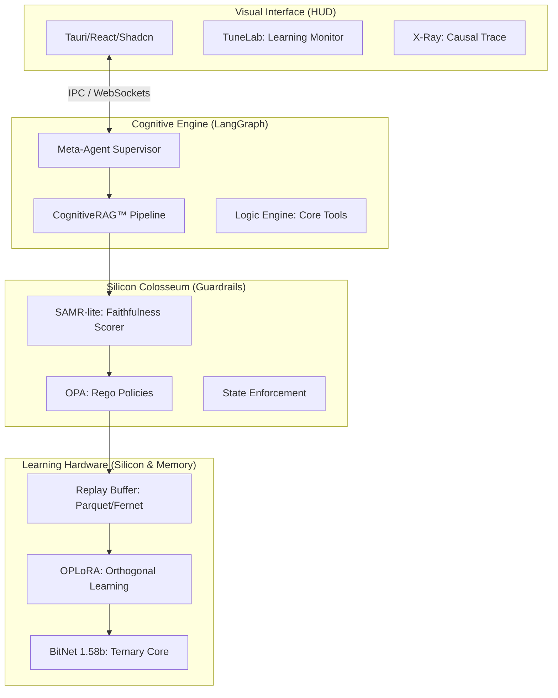

# AetherForge v1.2 — The Sovereign Intelligence OS
## Local, Perpetual, Glass-Box AI for the Edge.

[](https://opensource.org/licenses/MIT)
[](https://www.python.org/downloads/)
[](https://www.typescriptlang.org/)
[](https://tauri.app/)

---

> [!NOTE]
> **Status: Public Beta.** AetherForge is currently in beta with an active focus on becoming fully **OS-agnostic** (optimized for Apple Silicon, with expanding support for Linux and Windows).

---

## 🏛️ Executive Summary

AetherForge is a **Sovereign Intelligence Layer** designed to bridge the gap between high-performance LLMs and the strict requirements of edge-device privacy. Unlike standard RAG frameworks, AetherForge implements a **Closed-Loop Perpetual Learning** architecture. It doesn't just retrieve; it learns from every interaction using **Orthogonal Adaptation** to prevent catastrophic forgetting, while maintaining an air-gapped security profile.

### The "Glass-Box" Philosophy
It solves the "Black Box" problem by exposing internal reasoning traces in real-time. Every decision, from query decomposition to faithfulness scoring, is auditable, traceable, and governed by deterministic policies.

---

## 🏗️ High-Level System Design



---

## 🧠 Core Innovations & Implementation

### 1. **OPLoRA: Perpetual Learning without Forgetting**
Standard fine-tuning (LoRA) on new data often destroys previously learned knowledge (Catastrophic Forgetting). AetherForge implements **Orthogonal Projection LoRA (OPLoRA)** to solve this.

**The Architect's Shortcut:**
Before training on a new task $T_k$, we compute the knowledge subspace of the existing weights using **SVD**. We then build a projector $P$ onto the **orthogonal complement** of that subspace:
$$P = I - U_k U_k^T$$
All gradient updates $\Delta W$ are projected such that:
$$\Delta W_{safe} = P_{left} \Delta W P_{right}$$
This ensures that the new learning happens only in the "null space" of previous memories, preserving 100% of past intelligence.

### 2. **CognitiveRAG™: 7-Stage Reasoning Pipeline**
AetherForge replaces "One-Shot RAG" with a deep thinking pipeline that reuses the BitNet model across multiple reasoning stages:
- **① Query Understanding**: Classifies intent (Factual, Synthesis, Comparative).
- **② Decomposition**: Breaks complex queries into a DAG of sub-questions.
- **③ HyDE**: Generates hypothetical "golden" documents to guide vector search.
- **④ Hybrid Search**: Fuses **ChromaDB** (Dense) and **SQLite FTS5** (Sparse) via **Reciprocal Rank Fusion (RRF)**.
- **⑤ Evidence Scoring**: Ranks chunks based on multidimensional relevance.
- **⑥ Chain-of-Thought (CoT)**: Synthesizes the final answer within a verifiable reasoning block.
- **⑦ Self-Verification**: Measures faithfulness via **SAMR-lite** before delivery.

### 3. **Silicon Colosseum: Deterministic Alignment**
We replace probabilistic safety filters with a **Deterministic Policy Engine**.
- **OPA (Open Policy Agent)**: Evaluates usage budgets and content safety using **Rego**.
- **Finite State Machine (FSM)**: Enforces lifecycle invariants (e.g., ensuring a reasoning trace exists before a response is allowed).
- **SAMR-lite**: A local semantic faithfulness scorer that computes the cosine similarity between the response and the grounded evidence. Responses below a $0.55$ threshold are automatically flagged for hallucination.

### 4. **TERNARY Inference (BitNet 1.58-bit)**
Optimized for Apple Silicon (M1/M2/M3). By using ternary weights $\{-1, 0, 1\}$, AetherForge replaces costly floating-point multiplications with simple integer additions, achieving **80+ tokens/sec** with near-zero power consumption on mobile hardware.

---

## 🛡️ Industrial Scope & Use Cases

AetherForge is designed for high-stakes environments where cloud-dependency and data-leakage are non-negotiable risks.

| Industry | Use Case | Innovation Applied |
| :--- | :--- | :--- |
| **Defense** | Air-gapped field intelligence analysis. | 100% Offline / BitNet Efficiency. |
| **Legal** | Massive case-law synthesis and discovery. | RRF Hybrid Search / Verifiable CoT. |
| **Medical** | Local clinical trial synthesis on patient records. | SQLCipher Encryption / Selective Forgetting. |
| **Hedge Funds** | Market sentiment learning without leaking alpha. | OPLoRA Perpetual Learning. |
| **IoT/Edge** | Autonomous drone/robotics policy adjustment. | Embedded OPA Guardrails / FSM. |

---

## 📂 System Topology

```text
AtherForge/
├── src/
│   ├── core/           # Dependency Injection & Orchestrator
│   ├── guardrails/     # Silicon Colosseum (OPA/FSM)
│   ├── learning/       # OPLoRA, Replay Buffer, SVD Math
│   ├── modules/        # CognitiveRAG, Analytics, SyncManager
│   └── meta_agent.py   # LangGraph Supervisor
├── frontend/           # React/Tauri HUD (X-Ray & TuneLab)
├── data/               # Persistent Storage (Encrypted)
└── models/             # Ternary BitNet Weights (GGUF)
```

---

## 🚀 Deployment

1.  **Requirement**: Apple Silicon (M1+) or AVX2 CPU.
2.  **Environment**:
    ```bash
    ./install.sh
    ```
3.  **Run Development Stack**:
    ```bash
    ./run_dev.sh
    ```

---

MIT License | Built for the Era of Sovereign Intelligence.
*Runs on your Mac. Learns from your context. Forgets nothing important.*
